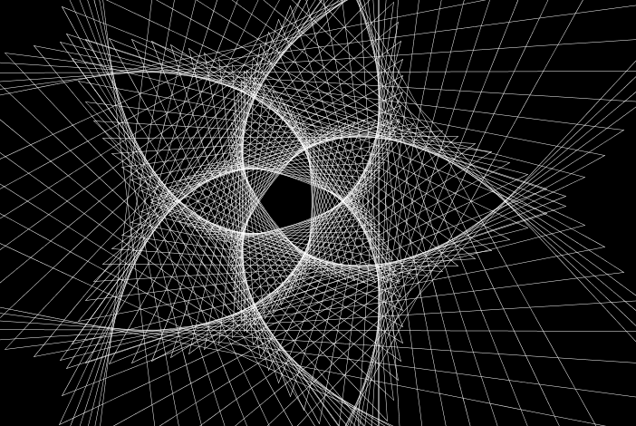
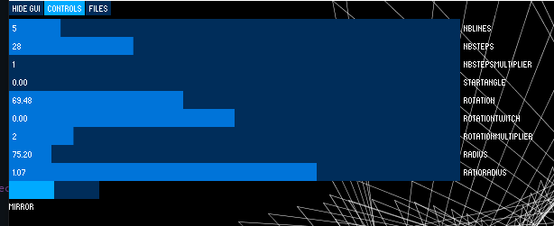
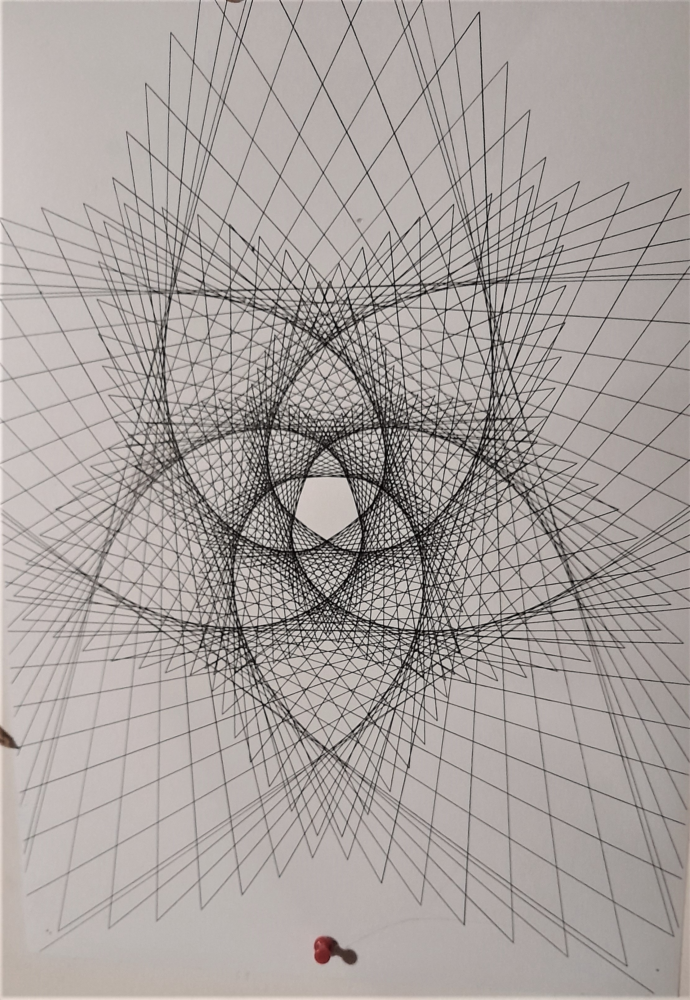
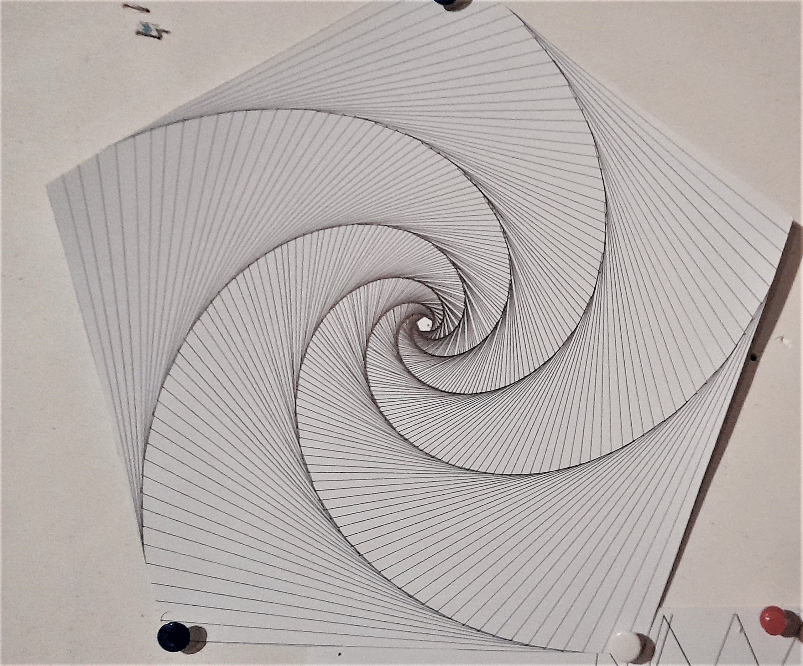
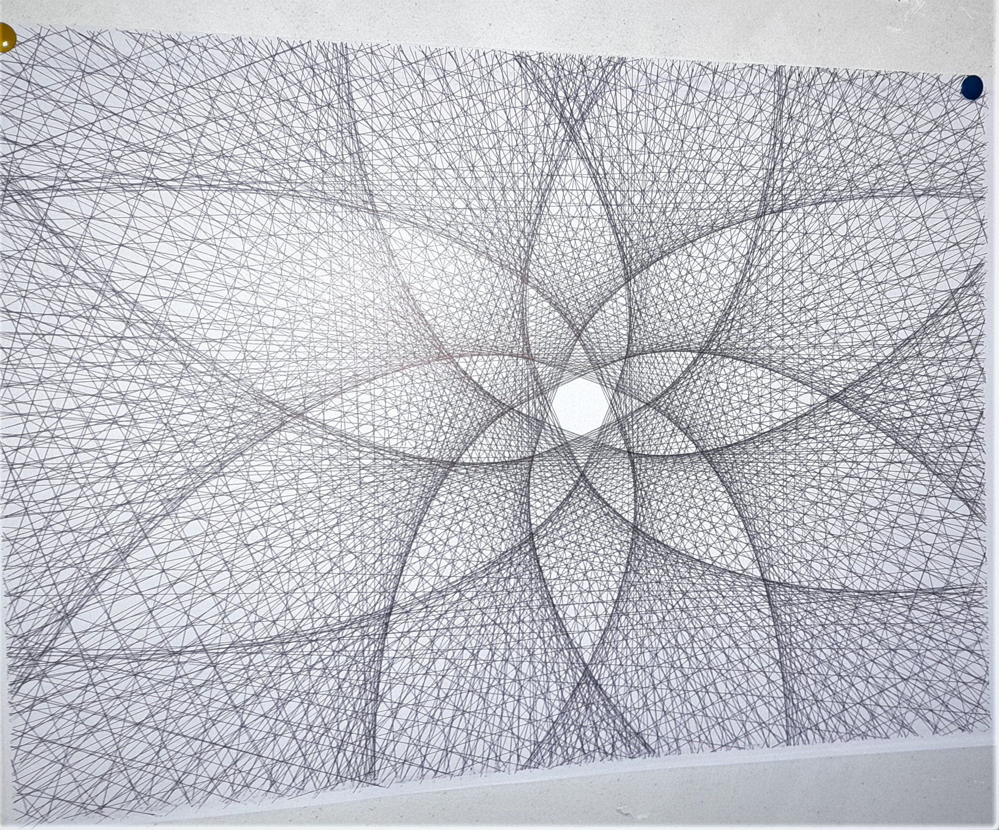

# spiral

Create Spirals drawing using processing.

# UI

The top button are Tabs.

* first tab just remove the UI
* **Controls** include all controls of the drawing
* **Files** is used to laod and save file.

## Controls
* **Nb Line** : the number of lines. sipateched orund a circle
* **Nb Steps** : nb of iteration step.
* **Nb Steps Multiplier** : Nb step multiplcation (to have very high number of iterations)
* **Start Angle** : angle of the first point.
* **Rotation** : how many degree are added each step
* **Rotation twitch** : fine adjust of the multiplication
* **Rotation multiplier** : Multiplication of the Rotation ratio
* **Radius** : the radius of the first step
* **Ratio Radius** : how many degres are added each step
* **Mirror** : toggle the y Mirror

## Files

Files can be saved to and from json.

the **"Saved"** Folder contain example of settings useful for starting and understanding the behvior of the components

you can alose export to differents formats : (svg, pdf and dxf)
the **"Export"** directory contains differents example of export

# drawing to paper

Nice drawin with a 2D plotter like a silhouette Cameo https://www.silhouetteamerica.com/featured-product/cameo
or any open source pen plotter : https://all3dp.com/2/pen-plotters-best-xy-plotters/

here are some result drawed bit a simple bic pen

# code

..... to be described

