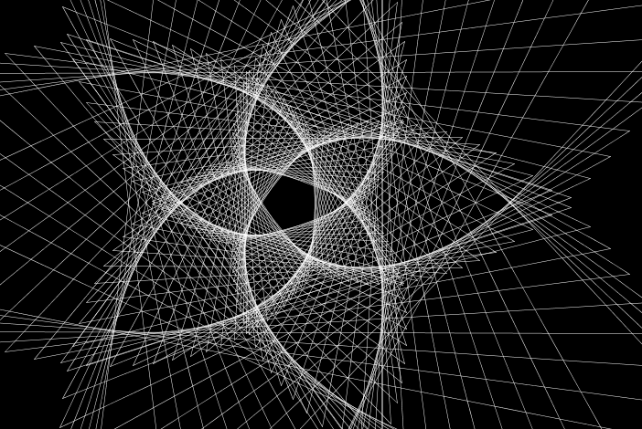
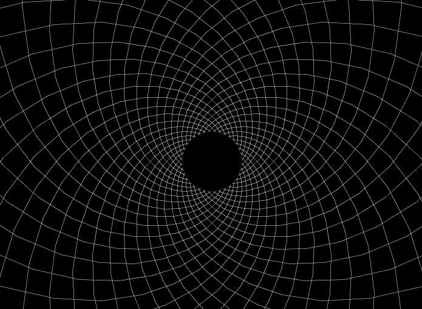
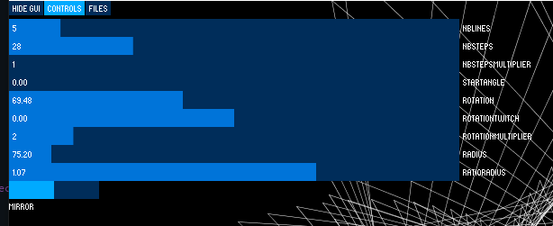
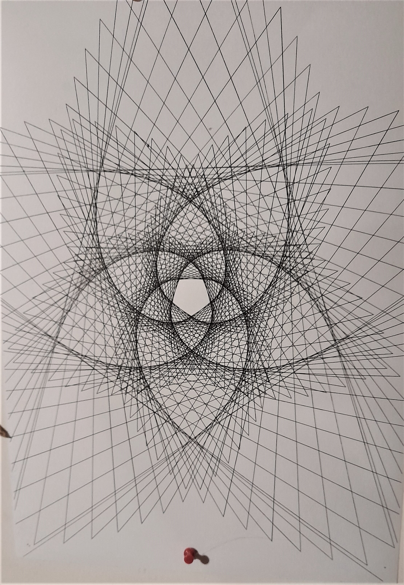
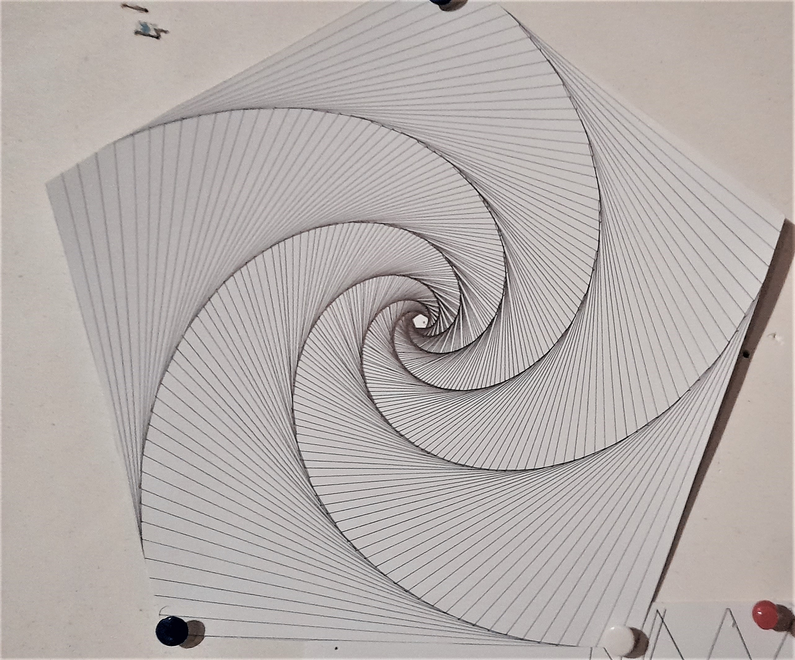
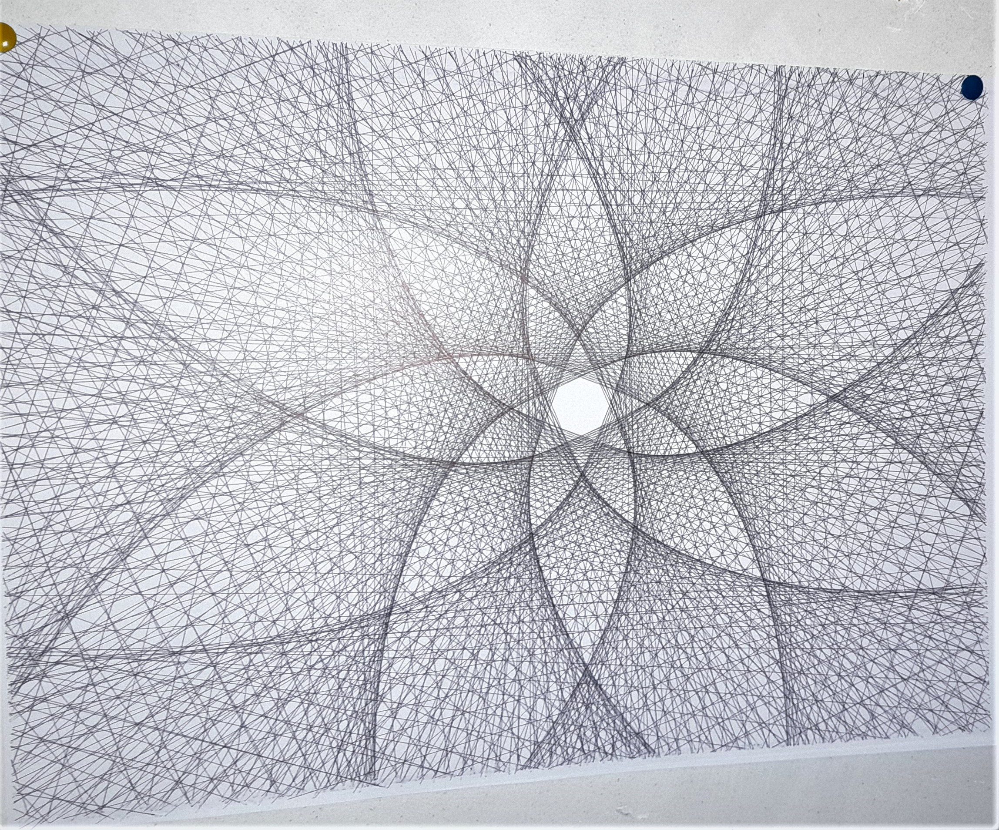

# spiral

Create Spirals drawing using processing.

---

## Getting a Release

No Processing, Java, or ControlP5 installation is required to run a release build — everything needed is bundled in the zip.

1. Download the release zip (see `releases/` or wherever it was shared with you).
2. Unzip it anywhere.
3. Run the `.exe` inside — that's it.

---

# UI

The top button are Tabs.

* first tab just remove the UI
* **Controls** include all controls of the drawing
* **Files** is used to laod and save file.

## Controls

* **Nb Line** : the number of lines, dispatched around a circle
* **Nb Steps** : nb of iteration step.
* **Nb Steps Multiplier** : Nb step multiplcation (to have very high number of iterations)
* **Start Angle** : angle of the first point.
* **Rotation** : how many degree are added each step
* **Rotation twitch** : fine adjust of the multiplication
* **Rotation multiplier** : Multiplication of the Rotation ratio
* **Radius** : the radius of the first step
* **Ratio Radius** : radius multiplier applied each step (below 1 spirals inward, above 1 spirals outward)
* **Mirror** : toggle the y Mirror

## Files

Files can be saved to and from json, using an in-app file browser in the **Files** tab (no native OS dialog) — Load and "Save as..." show a button per file/folder under `Settings/`, with `..` to go up and confirmation before overwriting an existing file.

the **"Settings"** Folder contain example of settings useful for starting and understanding the behvior of the components

you can alose export to differents formats : (svg, pdf and dxf)
the **"Export"** directory contains differents example of export

The Files tab also has clipping controls, including a **Clip Ratio** lock (`None`, `A4`, `16:9`, `4:3`, `Raisin`, or `1:1`, plus a `Landscape`/portrait toggle) — pick a ratio and dragging either the clip width or height slider keeps the other in proportion automatically.

---

# drawing to paper

Nice drawin with a 2D plotter like a silhouette Cameo https://www.silhouetteamerica.com/featured-product/cameo
or any open source pen plotter : https://all3dp.com/2/pen-plotters-best-xy-plotters/

here are some result drawed bit a simple bic pen

---

For the algorithm principle, file architecture, and how to build a release yourself, see [DEVELOPMENT.md](DEVELOPMENT.md).

---

## Changelog

### 2026-08-19 — xLib 3.13.4
- **Load / Save**: no longer opens a separate OS file-picker window (which could occasionally open hidden behind the main window) — replaced by an in-app file browser in the **Files** tab. Load and "Save as..." show buttons for every settings file and folder inside `Settings/`, with a `..` button to go up a level and Prev/Next if there are many files. Saving over an existing file asks for confirmation first; saving under a new name uses a text field pre-filled with the current file's name.
- **Clip Ratio**: the Files tab's clipping controls gained a ratio lock — pick `None` (free width/height, as before), `A4`, `16:9`, `4:3`, `Raisin`, or `1:1`, plus a `Landscape`/portrait toggle. With a ratio selected, dragging either the width or height slider keeps the other in proportion automatically.
- **`export_app.ps1`**: new build script — exports the sketch as a standalone application (embeds a JRE and all libraries, including ControlP5), copies `Settings/` into the export (not included by `processing-java --export`, and required at startup), and zips the result into `releases/` as a ready-to-share release. Same script copied verbatim across projects, same convention as the shared `xLib_*.pde` files.
- **README**: added a "Getting a Release" section (download, unzip, run) at the top; split implementation/architecture details and the build procedure out into a new [DEVELOPMENT.md](DEVELOPMENT.md); this is also the first version of this project's changelog. Fixed a stale `Ratio Radius` control description (it had been copy-pasted from `Rotation`'s).
- **`.gitignore`**: ignore `build_*/` and `releases/` (generated build output).
